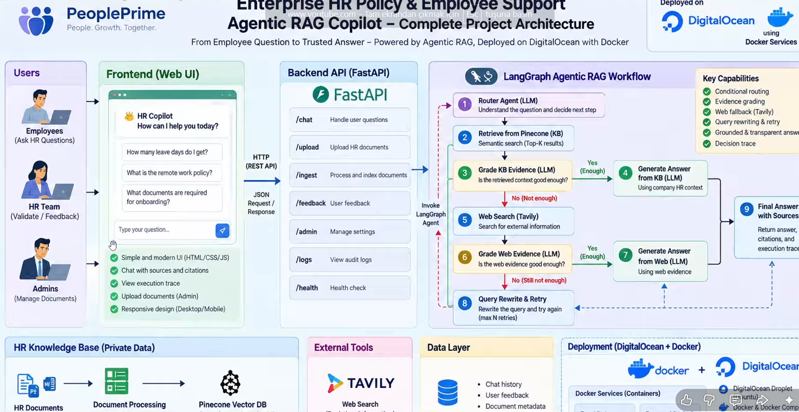
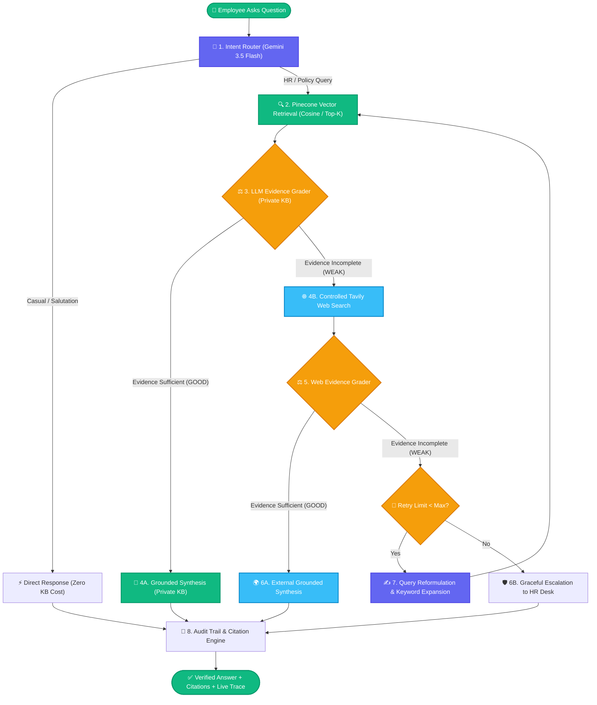

<div align="center">

# ⚡ Empower AI
### Autonomous Enterprise HR Agentic RAG Copilot
**Production-Grade Decision Machine • LangGraph StateGraph • Pinecone • Tavily • Gemini 3.5 Flash**

[](https://python.org)
[](https://fastapi.tiangolo.com)
[](https://langchain-ai.github.io/langgraph/)
[](https://pinecone.io)
[](https://ai.google.dev/)
[](https://docker.com)
[](https://digitalocean.com)
[](https://smith.langchain.com)

<br/>

<p align="center">
  <strong>Transforming enterprise knowledge access from naive probabilistic retrieval into deterministic, verifiable agentic workflows.</strong>
</p>

[Architecture](#-system-architecture) •
[Key Capabilities](#-key-capabilities) •
[Tech Stack](#-tech-stack-matrix) •
[Getting Started](#-local-development--quickstart) •
[Docker Deployment](#-production-docker--digitalocean-deployment) •
[API Reference](#-api-specification)

<br/>



</div>

---

## 📌 Executive Summary & Business Challenge

In enterprise environments like **People Prime Technologies (5,000+ employees)**, critical HR knowledge—leave quotas, remote stipends, healthcare tiers, payroll schedules, and conduct protocols—is fragmented across dozens of PDFs and internal portals.

### The Naive RAG Dilemma
1. **Keyword Search Fatigue:** Querying *"parental leave duration"* yields 10 raw documents without synthesizing an exact contextual answer.
2. **Hallucination & False Confidence:** Traditional RAG pipelines force LLMs to answer even when internal vector evidence is weak or absent, risking serious corporate misinformation.
3. **Stale Knowledge Boundaries:** Internal handbooks cannot answer time-sensitive statutory or public policy questions (e.g., *"What is the latest regional statutory public holiday update?"*).

### The Forward Deployed Engineer (FDE) Solution
**Empower AI** bridges the gap between proof-of-concept AI and battle-tested enterprise software. Engineered as a stateful, cyclical multi-agent system, it evaluates evidence validity before responding, self-corrects through query reformulation, falls back to controlled external web retrieval when appropriate, and provides end-to-end telemetry via **LangSmith** and **SQLite Audit Trails**.

---

## 🏗 System Architecture

Empower AI is powered by an autonomous **LangGraph StateGraph** engine operating with cyclic conditional execution:



---

## 🎯 Step-by-Step Workflow Matrix

| Step | Stage | Mechanism | Strategic Purpose |
| :--- | :--- | :--- | :--- |
| **01** | **Intent Classification** | `router_question` node | Eliminates costly vector searches for greetings and conversational chitchat. |
| **02** | **Private Retrieval** | `Pinecone Serverless` | Fetches dense chunks using HuggingFace `all-MiniLM-L6-v2` embeddings. |
| **03** | **Evidence Evaluation** | `grade_kb` node | LLM-as-a-Judge inspects context strictly against the prompt before generating answers. |
| **04** | **Controlled Web Fallback** | `Tavily Search API` | Safely looks beyond private walls for statutory updates, regional holidays, or recent laws. |
| **05** | **Self-Corrective Loop** | `rewrite_query` node | Transforms failed semantic queries with enriched HR keywords for a second retrieval attempt. |
| **06** | **Grounded Synthesis** | Context-Locked Generation | Strict policy prompt prohibits extrapolation; output is locked to validated citations. |
| **07** | **Observability & Trace** | `LangSmith` + `audit.db` | Every step, latency metric, and token count is traced live in the dashboard. |

---

## 🚀 Key Capabilities

- 🛡️ **Zero-Hallucination Guard:** Answers are generated **exclusively** from context validated by the evidence grading nodes.
- 🔁 **Cyclic Self-Correction:** When retrieval quality drops, the agent rewrites its own query up to configured retry thresholds.
- 🌐 **Controlled Hybrid Fallback:** Automatically identifies information boundaries and queries live web data without exposing internal policies.
- 📂 **Multi-Format Ingestion:** Instant chunking and embedding pipeline for `.pdf`, `.docx`, `.md`, and `.txt` documents via admin endpoint.
- ⚡ **Production-Optimized Containers:** Custom slim Docker image with CPU-only PyTorch build (**reduced from 5.2GB down to ~200MB**).
- 🎨 **Enterprise Glassmorphism UI:** Built with Vanilla CSS, responsive drawers, live LangGraph state visualizer, one-click copy, and Markdown rendering.

---

## 💻 Tech Stack Matrix

```
Empower AI / Core Technology Stack
├── Orchestration: LangGraph (Cyclic StateGraph Engine) & LangChain Core
├── Foundation Model: Google Gemini 3.5 Flash (via langchain-google-genai)
├── Vector Storage: Pinecone Serverless (us-east-1, Cosine Similarity)
├── Embeddings: HuggingFace sentence-transformers (all-MiniLM-L6-v2, 384 dim)
├── External Search: Tavily Search API (Topic: General, Answer & Citation Synthesis)
├── Serving Layer: FastAPI 0.115+, Uvicorn, Jinja2 Templates
├── Observability: LangSmith Tracing V2 & SQLite Audit Logging
└── Deployment: Docker (Multi-stage, CPU-optimized), DigitalOcean App Platform
```

---

## 📂 Repository Structure

```tree
Empower AI/
├── app/
│   ├── api/
│   │   └── routes.py           # FastAPI endpoints (/chat, /ingest, /health)
│   ├── core/
│   │   ├── config.py           # Pydantic Settings & environment manager
│   │   └── logging.py          # Structured operational logger
│   ├── rag/
│   │   ├── state.py            # TypedDict AgentState & Pydantic grading schemas
│   │   ├── vector_store.py     # Pinecone index lifecycle & retriever factory
│   │   └── workflow.py         # LangGraph nodes, conditional edges & compilation
│   ├── services/
│   │   ├── audit.py            # SQLite audit trail ledger
│   │   └── ingestion.py        # Recursive text splitter & multi-format loader
│   └── main.py                 # FastAPI application factory & template router
├── data/
│   └── sample_kb/              # Pre-indexed enterprise policy handbooks
├── static/
│   ├── css/style.css           # Modern corporate glassmorphism design system
│   └── js/app.js               # Reactive frontend with Marked.js & trace renderer
├── templates/
│   └── index.html              # Enterprise UI template with accessibility markup
├── Dockerfile                  # Production CPU-optimized multi-layer container
├── .dockerignore               # Security & container size exclusion rules
├── .env                        # Local configuration secrets (git-ignored)
├── pyproject.toml              # UV / PEP-621 project configuration
├── requirements.txt            # Locked production dependencies
├── run.py                      # Local development entrypoint
└── image.png                   # System workflow diagram asset
```

---

## 🛠 Local Development & Quickstart

### 1. Prerequisites
- **Python 3.13+** installed
- **uv** (recommended) or standard `pip`
- Valid API keys: [Google AI Studio](https://aistudio.google.com/), [Pinecone](https://pinecone.io), [Tavily](https://tavily.com), [LangSmith](https://smith.langchain.com)

### 2. Clone and Setup Environment
```bash
# Clone the repository
git clone https://github.com/MustafaKocamann/FDE-Agentic-Rag.git
cd FDE-Agentic-Rag

# Create and activate virtual environment
uv venv
# On Windows:
.venv\Scripts\activate
# On Unix/macOS:
source .venv/bin/activate

# Install dependencies
uv pip install -r requirements.txt
```

### 3. Configure Environment Variables
Create a `.env` file in the root directory:
```env
# Large Language Models
GOOGLE_MODEL=gemini-3.5-flash
GOOGLE_API_KEY="your-google-ai-api-key"

# Vector Database (Pinecone)
PINECONE_API_KEY="your-pinecone-api-key"
PINECONE_INDEX_NAME=fde-rag
PINECONE_NAMESPACE=company-kb
EMBEDDING_MODEL=all-MiniLM-L6-v2

# External Search
TAVILY_API_KEY="your-tavily-api-key"

# Observability (LangSmith Tracing)
LANGCHAIN_TRACING_V2=true
LANGCHAIN_API_KEY="your-langsmith-api-key"
LANGCHAIN_PROJECT=fde-agentic-rag-project
LANGCHAIN_ENDPOINT=https://api.smith.langchain.com

# Application Security
ADMIN_API_KEY="your-admin-secret-key"
```

### 4. Ingest Sample Knowledge Base
```bash
python ingest_sample_kb.py
```

### 5. Launch Development Server
```bash
python run.py
```
Open your browser and navigate to: **`http://127.0.0.1:8080`**

---

## 🐳 Production Docker & DigitalOcean Deployment

### 1. Build and Run Container Locally
The Dockerfile is optimized for **Cloud CPUs** by installing the lightweight CPU-only PyTorch build to avoid downloading 5GB+ of unused CUDA drivers:

```bash
# Build the Docker image
docker build -t empower-ai:latest .

# Run the container
docker run -d \
  -p 8080:8080 \
  --env-file .env \
  --name empower-ai-service \
  empower-ai:latest
```

### 2. DigitalOcean App Platform Deployment
1. Connect your GitHub repository to **DigitalOcean App Platform**.
2. Set resource type to **Web Service** using the detected `Dockerfile`.
3. Configure the HTTP Port to **`8080`**.
4. Add your secrets under **App Settings → Environment Variables** (`GOOGLE_API_KEY`, `PINECONE_API_KEY`, etc.).
5. Deploy! DigitalOcean will automatically build the CPU-optimized container and route HTTPS traffic to port `8080`.

---

## 📡 API Specification

### 💬 1. Interactive Chat Endpoint
**`POST /api/chat`**

Performs full LangGraph agentic reasoning, evidence evaluation, and grounded synthesis.

#### Request Body
```json
{
  "question": "How many days of paid annual leave do full-time employees get?"
}
```

#### Response Payload
```json
{
  "answer": "According to the People Prime Technologies Employee Handbook, full-time employees accrue 20 business days of paid annual leave per calendar year. Leave requests exceeding 3 consecutive days must be submitted at least 14 days in advance via the HR Portal.",
  "source_used": "private_kb",
  "rewritten_query": "How many days of paid annual leave do full-time employees get?",
  "trace": [
    "Router → KB",
    "Private KB retrieval → 4 chunks",
    "KB evidence grade → GOOD",
    "Answer generation → PRIVATE KB"
  ],
  "citations": [
    {
      "title": "company_hr.md",
      "url": "",
      "type": "private_kb"
    }
  ]
}
```

---

### 📄 2. Knowledge Ingestion Endpoint
**`POST /api/ingest`**

Uploads, validates, parses, chunks, and creates vector embeddings in Pinecone.

#### Headers
`X-Admin-Key: your-admin-secret-key`

#### Form Data
`file: document.pdf` *(Supported: .pdf, .docx, .txt, .md)*

#### Response Payload
```json
{
  "message": "Document indexed",
  "file": "company_hr_2026.pdf",
  "chunks": 18,
  "ids_created": 18
}
```

---

## 📊 Live Observability (LangSmith Integration)

Empower AI features native **LangSmith telemetry**. Every state transition, routing classification, retrieval latency, and model invocation is captured in real-time.

```
fde-agentic-rag-project
├── 🟢 LangGraph [Run: 1.24s]
│   ├── 🧭 route_question (ChatGoogleGenerativeAI) -> 'kb' [380ms]
│   ├── 🔍 retrieve_kb (Pinecone VectorStore) -> 4 Chunks [180ms]
│   ├── ⚖️ grade_kb (Evidence Evaluator) -> 'GOOD' [310ms]
│   └── ✍️ generate_from_kb (Grounded Synthesis) [370ms]
```

---

## 🛡️ License

Distributed under the **MIT License**. See `LICENSE` for more information.

---

<div align="center">
  <sub>Engineered by <strong>Mustafa Kocaman</strong> • Forward Deployed AI Engineer</sub>
  <br/>
  <sub>Empowering enterprise workforces through deterministic, self-correcting agent architectures.</sub>
</div>
